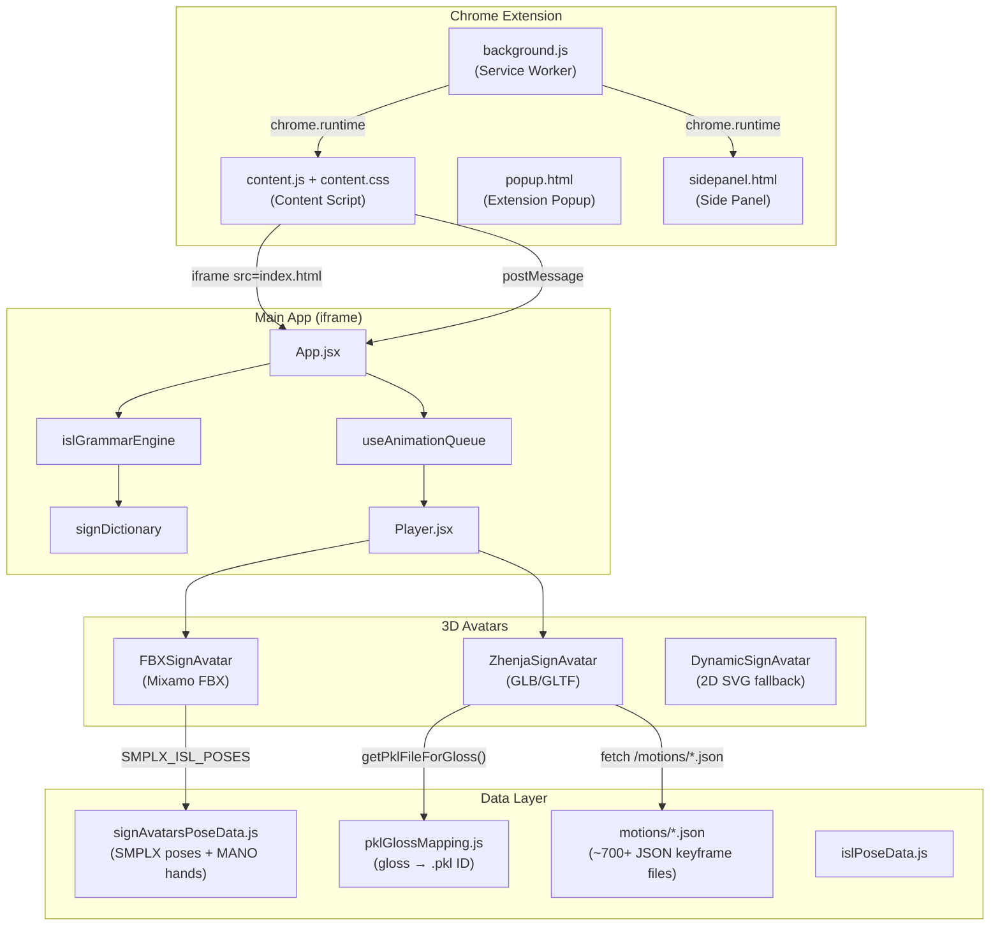

# 3D SignSTEM — Full Project Architecture

## Overview
**3D SignSTEM** is a **Chrome Extension (MV3)** + **Vite React web app** that provides a real-time **Indian Sign Language (ISL)** learning and translation companion using **3D avatars** powered by Three.js. It translates English text → ISL grammar → 3D avatar bone animations.

---

## Tech Stack

| Layer | Technology |
|-------|-----------|
| **Framework** | React (latest) + Vite |
| **Styling** | Tailwind CSS (latest) + inline JS styles |
| **3D Engine** | Three.js v0.185 (GLTFLoader, FBXLoader) |
| **Hand Detection** | MediaPipe Hands (bundled in `/public/vendor/`) |
| **Extension** | Chrome Manifest V3 (service worker, content script, side panel) |
| **Motion Data** | SMPL-X/HamNoSys .pkl → JSON keyframes (182 dimensions × N frames) |

---

## Entry Points (Multi-page Vite Build)

| HTML | React Root | Purpose |
|------|-----------|---------|
| [`index.html`](file:///e:/koo/index.html) | [`main.jsx`](file:///e:/koo/src/main.jsx) → [`App.jsx`](file:///e:/koo/src/App.jsx) | Main avatar player (embedded in iframe by content script) |
| [`popup.html`](file:///e:/koo/popup.html) | [`popup.jsx`](file:///e:/koo/src/popup.jsx) | Extension popup with live 3D preview, quick signs, theme selector |
| [`learn.html`](file:///e:/koo/learn.html) | [`learn.jsx`](file:///e:/koo/src/learn.jsx) | Full learning studio (STEM subjects) |
| [`sidepanel.html`](file:///e:/koo/sidepanel.html) | [`sidepanel.jsx`](file:///e:/koo/src/sidepanel.jsx) | Live hand recognition panel |

---

## Architecture Diagram



---

## Key Components

### Core App ([`App.jsx`](file:///e:/koo/src/App.jsx))
- Text input → ISL grammar transformation → animation queue
- Voice input (Web Speech API, `en-IN`)
- Tab audio capture (Chrome `tabCapture` API)
- Fingerspelling modal for long words (>6 chars)
- Webcam overlay, history, quiz mode, learning paths
- Two rendering modes: **in-frame** (widget) vs **full-screen** (standalone)
- PostMessage bridge for Chrome extension ↔ iframe communication

### Player ([`Player.jsx`](file:///e:/koo/src/components/Player.jsx))
- Switches between **Zhenja (GLB)** and **FBX (Mixamo)** avatar based on `avatarConfig.modelId`

### ZhenjaSignAvatar ([`ZhenjaSignAvatar.jsx`](file:///e:/koo/src/components/ZhenjaSignAvatar.jsx))
- Loads `/zhenja.glb` (Ready Player Me avatar) via `GLTFLoader`
- Fetches motion JSON files from `/motions/{id}.json` based on gloss token
- Interpolates SMPL-X 182-dim keyframes at 30fps across bones
- Animated gradient background with star particles
- Studio lighting (key + fill + rim)

### FBXSignAvatar ([`FBXSignAvatar/FBXSignAvatar.jsx`](file:///e:/koo/src/components/FBXSignAvatar/FBXSignAvatar.jsx))
- Loads `/Ch33_nonPBR.fbx` (Mixamo character) via `FBXLoader`
- Uses static SMPLX_ISL_POSES for bone-driven pose animation (lerp-based)
- 30-joint finger articulation via `MANO_HAND_SHAPES`
- Idle breathing, eye blink, float-bob animations
- Animated radial gradient background + 60 star particles + ground glow
- 4-point studio lighting setup

---

## Data Pipeline

```
English Text
    ↓
islGrammarEngine.js (SOV reorder, stop-word removal, time-first)
    ↓
signDictionary.js (resolve tokens → queue items, fingerspelling fallback)
    ↓
useAnimationQueue.js (sequential playback with idle loop)
    ↓
Player.jsx → Avatar Component
    ↓
pklGlossMapping.js → motions/{id}.json (Zhenja)
   OR
signAvatarsPoseData.js (FBX static poses)
```

### Motion Data Format (SMPL-X 182-dim)
| Dims | Content |
|------|---------|
| 0–2 | Global root rotation |
| 3–5 | Root translation (x, y, z) |
| 6–68 | Body joints (spine, neck, head, shoulders, elbows, wrists) |
| 69–113 | Left hand MANO (15 joints × 3) |
| 114–158 | Right hand MANO (15 joints × 3) |
| 159–181 | Jaw & facial expression |

---

## Chrome Extension Architecture

### [`manifest.json`](file:///e:/koo/public/manifest.json) (MV3)
- **Permissions**: `storage`, `tabs`, `tabCapture`, `sidePanel`
- **Content script**: Injected on all HTTP/S pages
- **Service worker**: [`background.js`](file:///e:/koo/public/background.js)
- **Side panel**: Live recognition via MediaPipe

### [`content.js`](file:///e:/koo/public/content.js)
- Creates floating widget (draggable, min/max/close)
- Embeds `index.html` in iframe
- Auto-syncs YouTube/Netflix/etc. captions via MutationObserver
- Auto-signs text selection on any page
- Caption scraping: YouTube `.ytp-caption-segment`, Netflix, VJS, WebVTT tracks

### [`background.js`](file:///e:/koo/public/background.js)
- Settings management (`chrome.storage.sync`)
- Message routing (settings, studio open, recognition relay, tab capture)
- Side panel management

---

## Custom Hooks

| Hook | File | Purpose |
|------|------|---------|
| `useAnimationQueue` | [`useAnimationQueue.js`](file:///e:/koo/src/hooks/useAnimationQueue.js) | Sequential sign playback with idle loop, pause/skip/speed |
| `useHistory` | [`useHistory.js`](file:///e:/koo/src/hooks/useHistory.js) | Sign history tracking (last 50) |
| `useKeyboardShortcuts` | [`useKeyboardShortcuts.js`](file:///e:/koo/src/hooks/useKeyboardShortcuts.js) | Space, Esc, M, H, Q, W shortcuts |
| `useScreenCapture` | [`useScreenCapture.js`](file:///e:/koo/src/hooks/useScreenCapture.js) | Camera/screen capture for recognition |
| `useSignRecognition` | [`useSignRecognition.js`](file:///e:/koo/src/hooks/useSignRecognition.js) | MediaPipe hand landmark → gesture classification |

---

## Utilities

| File | Purpose |
|------|---------|
| [`islGrammarEngine.js`](file:///e:/koo/src/utils/islGrammarEngine.js) | English → ISL syntax (SOV, time-first, stop-word removal) |
| [`smplxPklLoader.js`](file:///e:/koo/src/utils/smplxPklLoader.js) | Parse 182-dim SMPL-X arrays → structured keyframes |
| [`gestureClassifier.js`](file:///e:/koo/src/utils/gestureClassifier.js) | MediaPipe landmarks → ISL sign classification |
| [`signScorer.js`](file:///e:/koo/src/utils/signScorer.js) | Sign accuracy scoring (shape, position, orientation) |
| [`ikSolver.js`](file:///e:/koo/src/utils/ikSolver.js) | Inverse kinematics for arm chains |
| [`videoExporter.js`](file:///e:/koo/src/utils/videoExporter.js) | Canvas recording to video |
| [`shareLink.js`](file:///e:/koo/src/utils/shareLink.js) | URL-based sign sharing |

---

## Constants

| File | Purpose |
|------|---------|
| [`signAvatarsPoseData.js`](file:///e:/koo/src/constants/signAvatarsPoseData.js) | 15+ ISL word poses + 11 MANO hand shapes + A-Z fingerspelling |
| [`signDictionary.js`](file:///e:/koo/src/constants/signDictionary.js) | Token → .webm asset mapping + fingerspelling fallback |
| [`pklGlossMapping.js`](file:///e:/koo/src/constants/pklGlossMapping.js) | 80+ gloss → .pkl file ID mapping (STEM vocab) |
| [`islPoseData.js`](file:///e:/koo/src/constants/islPoseData.js) | Additional ISL pose data |
| [`avatarCustomization.js`](file:///e:/koo/src/constants/avatarCustomization.js) | Avatar config, themes |

---

## Assets

| Asset | Size | Format |
|-------|------|--------|
| `zhenja.glb` | ~9 MB | Ready Player Me GLTF avatar |
| `Ch33_nonPBR.fbx` | ~55 MB | Mixamo rigged character |
| `motions/*.json` | 700+ files | SMPL-X keyframe data (converted from HamNoSys .pkl) |
| `hamnosys_pkls_default_shape/` | ~1.1 GB (zip) | Original .pkl motion capture files |

---

## Build & Scripts

| Script | Command |
|--------|---------|
| Dev server | `npm run dev` (Vite) |
| Extension build | `npm run build` → [`build-extension.mjs`](file:///e:/koo/scripts/build-extension.mjs) |
| PKL → JSON conversion | [`convert_all_pkls.py`](file:///e:/koo/scripts/convert_all_pkls.py) |
| Blender SMPL-X motion | [`blender_apply_smplx_motion.py`](file:///e:/koo/scripts/blender_apply_smplx_motion.py) |
| Icon generation | [`generate-icons.mjs`](file:///e:/koo/scripts/generate-icons.mjs) |

---

## ISL Vocabulary Coverage

- **Core Signs**: HELLO, NAMASTE, YOU, ME, HOW, WHAT, THANK_YOU, PLEASE, HELP, GOOD, YES, NO, etc.
- **Physics**: MOTION, FORCE, GRAVITY, ENERGY, LIGHT, WAVE, VELOCITY, ACCELERATION, MASS
- **Mathematics**: NUMBER, EQUAL, ADD, SUBTRACT, MULTIPLY, DIVIDE, CIRCLE, TRIANGLE, ANGLE
- **Chemistry**: ATOM, MOLECULE, ELEMENT, REACTION, LIQUID, GAS, SOLID
- **Biology**: CELL, DNA, HEART, BRAIN, PLANT
- **Computer Science**: COMPUTER, CODE, ALGORITHM, DATA, NETWORK, DATABASE, PYTHON, JAVA
- **Fingerspelling**: Full A–Z + 0–9 (both static poses and .webm fallback)
